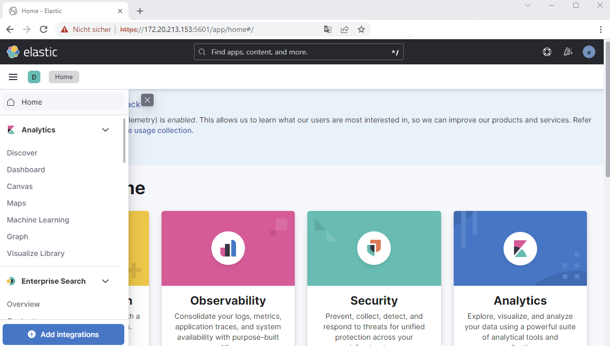
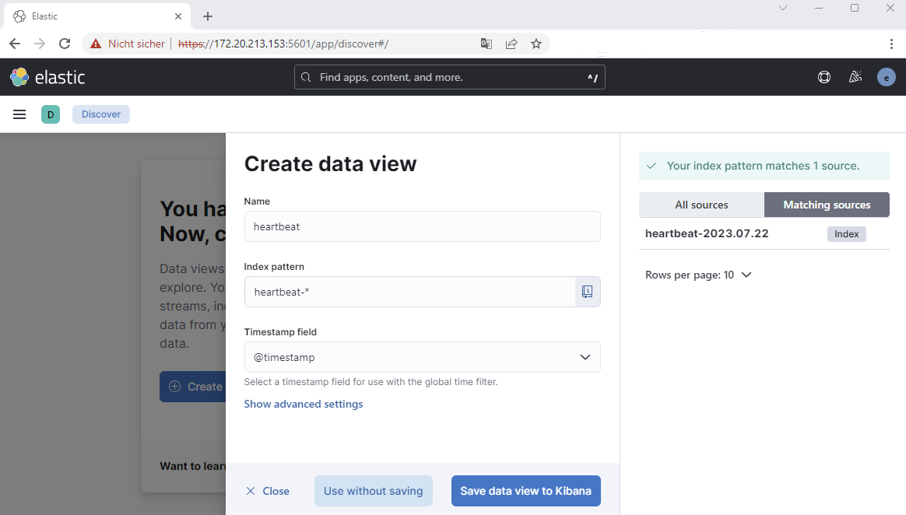
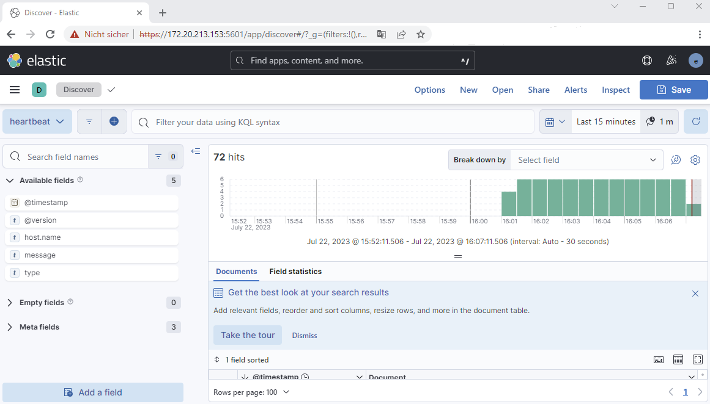

ELKy is a docker-compose project for running the ELK-Stack in an easy way. ELKy is a result of my former project
'elastax' that contained various elastic stacks (recipes) - so called a cookbook.
To keep it simple this project contains only the ELK Stack which should help you to get up an running with Elasticsearch/\
Logstash/Kibana on your local box for learning and dev purposes without any effort. Have fun! 

Please give us a [GitHub Star](https://github.com/schneidermatic/ELKy/stargazers)
if you like the project. Thank you in advance!

###### ELK REFERENCES
---
Elasticsearch: [https://www.elastic.co/guide/en/elasticsearch/reference/current/index.html](https://www.elastic.co/guide/en/elasticsearch/reference/current/index.html)  
Logstash: [https://www.elastic.co/guide/en/logstash/current/index.html](https://www.elastic.co/guide/en/logstash/current/index.html)  
Kibana: [https://www.elastic.co/guide/en/kibana/current/index.html](https://www.elastic.co/guide/en/kibana/current/index.html)  

###### PREREQUISITES
---
ELKy is tested on Windows 11, Docker Desktop and Windows Subsystem for Linux (WSL2)

Name           | Reference    
-------------- | --------------- 
Windows        | >= 11
Docker Desktop | >= 4.12.0
WSL            | >= 2
Ubuntu         | >= 20.04.6 LTS (Focal Fossa)
docker         | [https://docs.docker.com/engine/reference/run/](https://docs.docker.com/engine/reference/run/)
docker-compose | [https://docs.docker.com/compose/reference/overview/](https://docs.docker.com/compose/reference/overview/)

INITIALIZING
---
Before you can run the ELK-Stack with WSL2 you have to change the '.wslconfig' file.

01. Create .wslconfig file under your Windows user profile directoy

        C:\Users\<YourUsername>\.wslconfig

02. Add the following lines to '.wslconfig'

        [wsl2]
        kernelCommandLine = "sysctl.vm.max_map_count=262144"

03. Restart WSL from Windows Command Line

        $ wsl.exe --shutdown
    
**NOTE:** More information here https://learn.microsoft.com/en-us/windows/wsl/
   
SETUP
---

01. Clone the ELKy repo

        $ cd $HOME
        $ git clone https://github.com/schneidermatic/ELKy.git

02. Setup your environment

        $ cd ELKy
        $ source ./.xrc
        $ x_setup

    **NOTE:** x_setup modifies Linux Kernel parameters and reboots your host system after 30 seconds\
    due to the modifications of the kernel parameters.
      
03. Go into the stack folder and run docker-compose

        $ cd $HOME/ELKy/stack
        $ docker-compose up -d

04. Get your IP-Address with ifconfig

        $ ifconfig

    

05. Use Kibana in your Browser for further actions

        https://<YourIPAddress!!!>:5601

    

    **user: elastic**\
    **password: changeme**

06. Create your first Data 

    

    **Select on the left side 'Discover'**

07. Create a data View

    
    
08. Define the Index Pattern

    

09. Heartbeat Log Data View

    

    **NOTE:** In the Logstash file './stack/resources/ls01/pipeline/event.pipeline' there is an heartbeat input defined\
    that sends events to elasticsearch in an interval of 5 sec.

Stop and Start the ELK Stack
---

01. Stop the docker containers

        $ docker-compose stop

02. Start the docker containers

        $ docker-compose start 

Remove the entire stack
---

01. Remove the docker containers

        $ docker-compose down -v

    **NOTE:** when you run 'docker-compose down -v' you'll loose all your data too!!!

CONTRIBUTING
---
If you find some bugs or have any requests/suggestions don't hesitate to open an issue or make a pull request.
