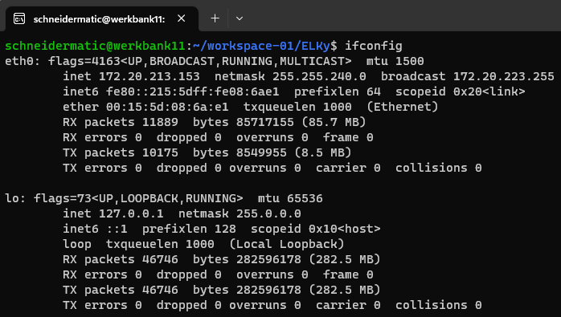
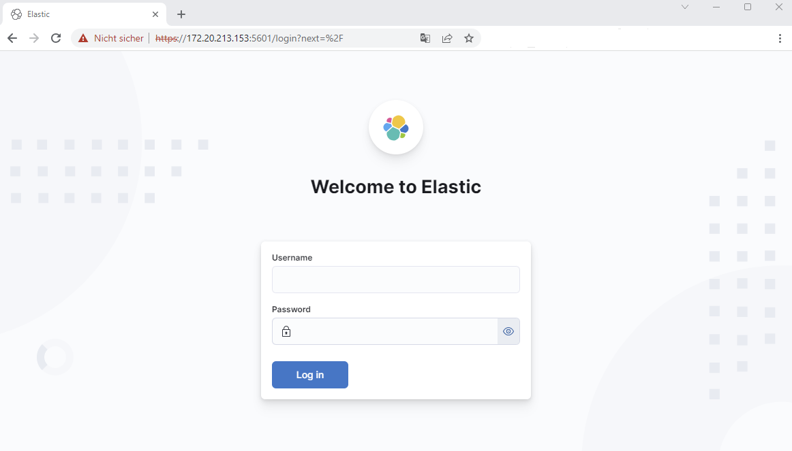
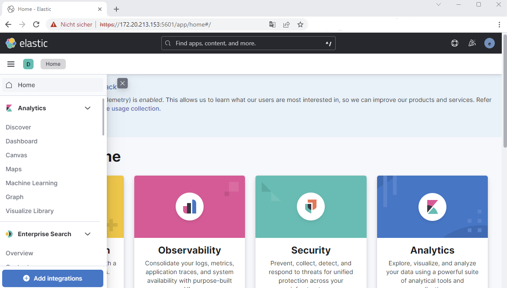
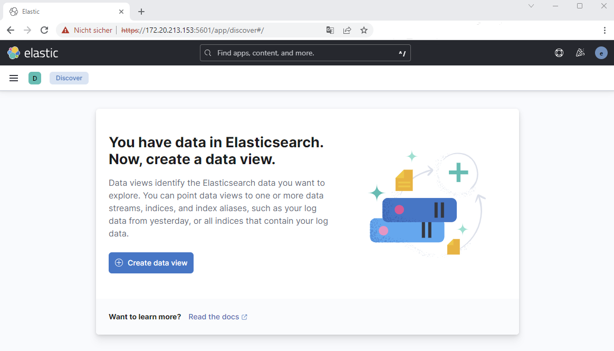
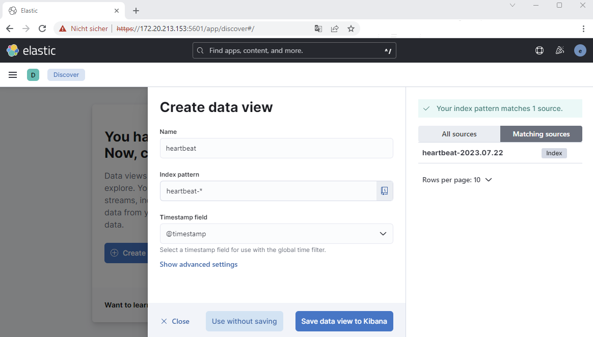
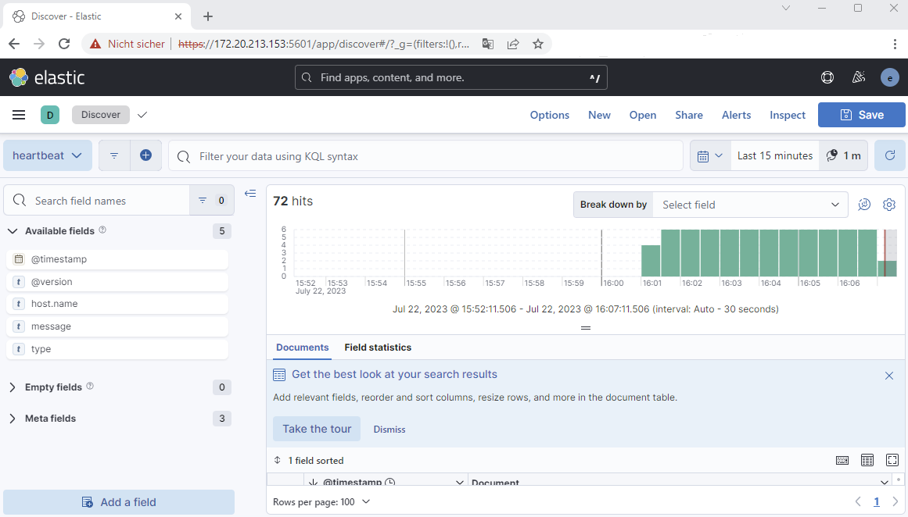

MiniELK is a docker-compose project for running the ELK-Stack in an easy way. MiniELK is based on the Elastic-Stack
and uses an Elastic Trial-License for 30 Days.
To keep it simple this project contains only the ELK Stack which should help you to get up an running with Elasticsearch,
Logstash, Kibana on your local sytem.

Here’s why you should get started with MiniELK on your local machine:

𝟭. 𝗤𝘂𝗶𝗰𝗸 𝗦𝗲𝘁𝘂𝗽 𝘄𝗶𝘁𝗵 𝗗𝗼𝗰𝗸𝗲𝗿: Spin up your environment in minutes, thanks to Docker-Compose.

𝟮. 𝗜𝘀𝗼𝗹𝗮𝘁𝗲𝗱:  Play around with Elasticsearch, Kibana, and Logstash right on your local (isolated) setup.

𝟯. 𝗡𝗼-𝗗𝗲𝗽𝗲𝗻𝗱𝗲𝗻𝗰𝗶𝗲𝘀: Customize your environment to suit your unique needs without any cloud dependencies.

𝟰. 𝗖𝗼𝘀𝘁-𝗘𝗳𝗳𝗶𝗰𝗶𝗲𝗻𝘁: No need for expensive cloud resources. Utilize your local hardware to its fullest potential.

𝟱. 𝗡𝗲𝘄-𝗙𝗲𝗮𝘁𝘂𝗿𝗲𝘀: Perfect for learning and testing new features.

Get hands-on with MiniELK today and take a look at the latest features!

Please give the project a [GitHub Star](https://github.com/schneidermatic/MiniELK/stargazers)
if you like it. Thank you very much in advance!

### ELASTIC v9.x
---
What's new in Elastic 9.x? [https://www.elastic.co/blog/elastic-stack-9-3-2-released](https://www.elastic.co/blog/elastic-stack-9-3-2-released)  

### ELK REFERENCES
---
Elasticsearch: [https://www.elastic.co/guide/en/elasticsearch/reference/current/index.html](https://www.elastic.co/guide/en/elasticsearch/reference/current/index.html)  
Logstash: [https://www.elastic.co/guide/en/logstash/current/index.html](https://www.elastic.co/guide/en/logstash/current/index.html)  
Kibana: [https://www.elastic.co/guide/en/kibana/current/index.html](https://www.elastic.co/guide/en/kibana/current/index.html)  

### ELASTIC & DOCKER COMPOSE
---
[Getting started with the Elastic Stack and Docker Compose: Part 1](https://www.elastic.co/blog/getting-started-with-the-elastic-stack-and-docker-compose)  
[Getting started with the Elastic Stack and Docker Compose: Part 2](https://www.elastic.co/blog/getting-started-with-the-elastic-stack-and-docker-compose-part-2)  

### PREREQUISITES
---
MiniELK is tested on Windows 11, Docker Desktop and Windows Subsystem for Linux (WSL2)

Name           | Reference    
-------------- | --------------- 
Windows        | >= 11
Docker Desktop | >= 4.12.0
WSL            | >= 2
Ubuntu         | >= 20.04.6 LTS (Focal Fossa)
docker         | [https://docs.docker.com/engine/reference/run/](https://docs.docker.com/engine/reference/run/)
docker-compose | [https://docs.docker.com/compose/reference/overview/](https://docs.docker.com/compose/reference/overview/)

INITIALIZING
---
Before you can run the ELK-Stack with WSL2 you have to change the '.wslconfig' file.

01. Create .wslconfig file under your Windows user profile directoy

        C:\Users\<YourUsername>\.wslconfig

02. Add the following lines to '.wslconfig'

        [wsl2]
        kernelCommandLine = "sysctl.vm.max_map_count=262154"

03. Shutdown Ubuntu from PowerShell

        windows~$> wsl.exe --shutdown

04. Start Ubuntu again from PowerShell

        windows~$> start ubuntu
    
**NOTE:** More information here https://learn.microsoft.com/en-us/windows/wsl/ \
          Basis Setup of Ubuntu under wsl2 https://youtu.be/X3bPWl9Z2D0
   
SETUP
---

01. In Ubuntu clone the MiniELK repo

        ubuntu~$> cd $HOME
        ubuntu~$> git clone https://github.com/schneidermatic/MiniELK.git

02. Setup your environment

        ubuntu~$> cd MiniELK/stack
        ubuntu~$> source ./.xrc
        ubuntu~$> x_setup

    **NOTE:** x_setup modifies Linux Kernel parameters.

03. Rebooting Ubuntu from PowerShell in Windows

        windows~$> wsl --list
        windows~$> wsl --shutdown "Ubuntu (Default)"
        windows~$> start ubuntu
      
04. After the rebooting of Ubuntu go into the stack folder and run ...

        ubuntu~$> cd $HOME/MiniELK/stack
        ubuntu~$> docker-compose up -d

04. Get your IP-Address with ifconfig (only if localhost doesn't work)

        ubuntu~$> ifconfig

    

05. Use Kibana in your Browser for further actions

        https://localhost:5601

    

    **user: elastic**\
    **password: changeme**

06. Create your first Data

    

    **Select on the left side 'Discover'**

07. Create a Data View

    

08. Define the Index Pattern

    

09. Heartbeat Log Data View

    

    **NOTE:** In the Logstash file './stack/resources/ls01/pipeline/event.pipeline' there is an heartbeat input defined\
    that sends events to elasticsearch in an interval of 5 sec.

Stop and Start the ELK Stack
---

01. Stop the docker containers

        ubuntu~$> docker-compose stop

02. Start the docker containers

        ubuntu~$> docker-compose start 

Remove the entire stack
---

01. Remove the docker containers

        ubuntu~$> docker-compose down -v

    **NOTE:** when you run 'docker-compose down -v' you'll loose all your data too!!!

CONTRIBUTING
---
If you find some bugs or have any requests/suggestions don't hesitate to open an issue or make a pull request.
